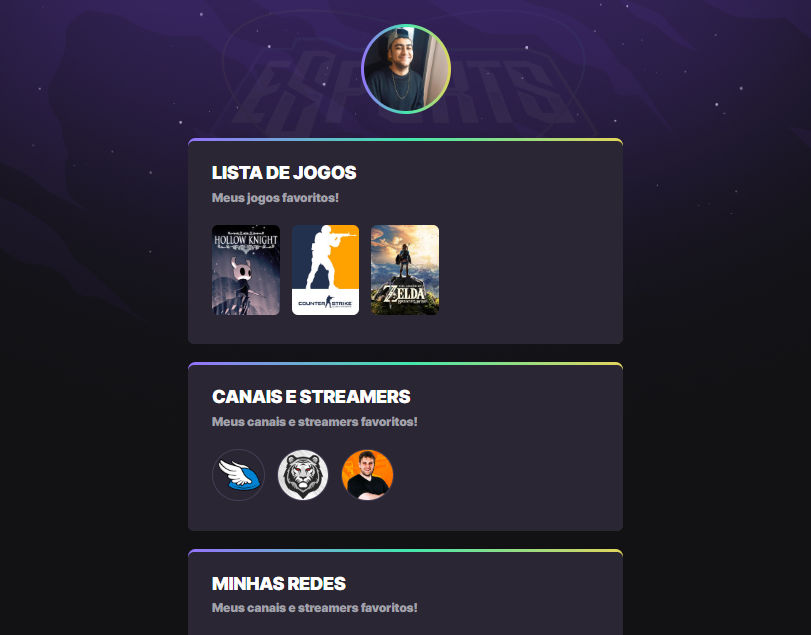

# NLW eSports

________________________________
## - SOBRE

Projeto construído para Trilha Explorer do evento Next Level Week (NLW) da Rocketseat.

>Instrutor

[Mayk Brito](https://maykbrito.dev/)

> Escopo

Criar um perfil que apresente meus jogos, canais de vídeo e streamers favoritos e minhas redes sociais.

> Detalhado

* O Topo do perfil apresenta uma foto, no caso, utilizando minha foto de perfil do GitHub.

* Criado um conjunto para cada elemento (Jogos, Canais, Redes), cada item listado recebe uma imagem representando o item e ao ser clicado, uma nova aba no navegador será aberta apresentando o conteúdo na Twitch do item clicado. No caso das redes, uma nova aba no navegador será aberta apresentando meu perfil da rede desejada.

* Os elementos possuem estilização e animação de escala, movimento e transparência.
________________________________
## - TECNOLOGIAS

- HTML
- CSS
- Git e Github
________________________________
## - PROJETO

[Clique aqui para acessar o projeto;](https://nathancaleb.github.io/nlw-esports-explorer/)
________________________________
## - CONTATO

E-mail: nathancalebss@gmail.com
